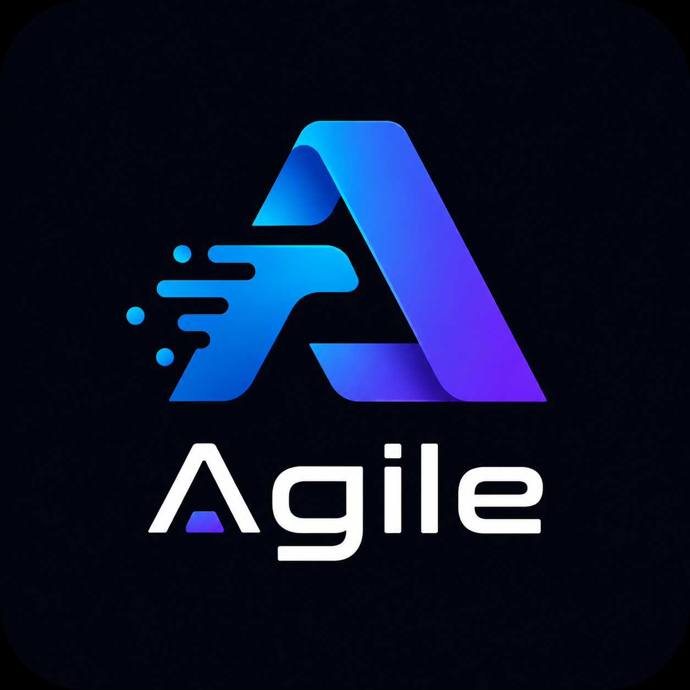

<div align="center">

# Agile.Maui



**Native, modular components for .NET MAUI**

[](https://www.nuget.org/packages/Agile.Maui.Gallery)
[](https://www.nuget.org/packages/Agile.Maui.Pdf)
[](https://www.nuget.org/packages/Agile.Maui.VirtualizedCollection)
[](https://www.nuget.org/packages/Agile.Maui.ChipGroup)
[](https://www.nuget.org/packages/Agile.Maui.SignaturePad)


`ImageView` / `GalleryView` | `PdfViewer` / `PdfReaderView` | `VirtualizedCollectionView` | `ChipGroup` | `SignaturePad`

[Overview](#overview) | [Features](#features) | [Projects](#projects) | [Platforms](#platforms) | [Documentation](#additional-documentation)

</div>

A .NET MAUI component library with native implementations for Android, iOS,
macOS Catalyst, and Windows. The current solution is modular: each component lives in its
own project/package, but they all share the C# namespace `Agile.Maui`.

## Overview

Agile.Maui is a collection of native MAUI controls for common mobile and desktop app
scenarios: zoomable images, galleries, PDF reading, virtualized lists, chip-based selections,
and signature capture.
Each module can be installed separately, so the app consumes only what it uses.

### Why use it

- Native controls per platform; the PDF viewer does not rely on `WebView` and images use native views.
- Independent packages sharing the same C# namespace.
- Bindable APIs for XAML and MVVM.
- Platform-specific handlers for Android, iOS, macOS Catalyst, and Windows.
- Sample app and per-component documentation.

## Features

| Module | Key features |
|---|---|
| `Agile.Maui.Gallery` | `ImageView` with native loading, bounded decode, load state, zoom/fullscreen, and `GalleryView` with image navigation. |
| `Agile.Maui.Pdf` | Base `PdfViewer` and a ready-to-use `PdfReaderView` with search, print/share, zoom, thumbnails, and navigation. |
| `Agile.Maui.VirtualizedCollection` | High-performance virtualized list for large volumes of items. |
| `Agile.Maui.ChipGroup` | Chip selection control with single/multiple selection and wrap, horizontal, or vertical layout modes. |
| `Agile.Maui.SignaturePad` | Freehand signature capture with vector strokes, pressure metadata, undo/redo, and PNG/JPEG export. |

## Requirements

- .NET MAUI / .NET 10.0 for the stable packages (`1.0.4`).
- .NET MAUI / .NET 11.0 preview for the preview packages (`1.0.4-preview.1`).
- Android, iOS, macOS Catalyst, or Windows.
- Registration of the package used in `MauiProgram.cs`.

## Projects

| Project | Package / Assembly | Components | Documentation |
|---|---|---|---|
| `GalleryView` | `Agile.Maui.Gallery` | `ImageView`, `GalleryView` | [docs/GalleryView.md](docs/GalleryView.md) |
| `PDFViewer` | `Agile.Maui.Pdf` | `PdfViewer`, `PdfReaderView` | [docs/PDFViewer.md](docs/PDFViewer.md) |
| `VirtualizedCollectionView` | `Agile.Maui.VirtualizedCollection` | `VirtualizedCollectionView` | [docs/VirtualizedCollectionView.md](docs/VirtualizedCollectionView.md) |
| `ChipGroup` | `Agile.Maui.ChipGroup` | `ChipGroup` | [docs/ChipGroup.md](docs/ChipGroup.md) |
| `SignaturePad` | `Agile.Maui.SignaturePad` | `SignaturePad` | [docs/SignaturePad.md](docs/SignaturePad.md) |
| `sample` | sample application | demos of all components | [docs/Sample.md](docs/Sample.md) |

`Controls_old` is a legacy copy of the old monolithic project and is not part of the
active solution.

## Installation

Install only the packages your application actually uses:

```powershell
dotnet add package Agile.Maui.Gallery --version 1.0.4
dotnet add package Agile.Maui.Pdf --version 1.0.4
dotnet add package Agile.Maui.VirtualizedCollection --version 1.0.4
dotnet add package Agile.Maui.ChipGroup --version 1.0.4
dotnet add package Agile.Maui.SignaturePad --version 1.0.4
```

For .NET 11 preview projects, use the preview package channel:

```powershell
dotnet add package Agile.Maui.Gallery --version 1.0.4-preview.1
dotnet add package Agile.Maui.Pdf --version 1.0.4-preview.1
dotnet add package Agile.Maui.VirtualizedCollection --version 1.0.4-preview.1
dotnet add package Agile.Maui.ChipGroup --version 1.0.4-preview.1
dotnet add package Agile.Maui.SignaturePad --version 1.0.4-preview.1
```

Then register the handlers in `MauiProgram.cs`:

```csharp
using Agile.Maui;

builder
    .UseMauiApp<App>()
    .UseAgileGalleryView()
    .UseAgilePdfViewer()
    .UseAgileVirtualizedCollectionView()
    .UseAgileChipGroup()
    .UseAgileSignaturePad();
```

Each method is independent. If the application uses only PDF, for example, call
only `UseAgilePdfViewer()`.

## XAML

The C# namespace is the same, but the XAML assembly changes per package:

```xml
xmlns:gallery="clr-namespace:Agile.Maui;assembly=Agile.Maui.Gallery"
xmlns:pdf="clr-namespace:Agile.Maui;assembly=Agile.Maui.Pdf"
xmlns:virtualized="clr-namespace:Agile.Maui;assembly=Agile.Maui.VirtualizedCollection"
xmlns:chips="clr-namespace:Agile.Maui;assembly=Agile.Maui.ChipGroup"
xmlns:signature="clr-namespace:Agile.Maui;assembly=Agile.Maui.SignaturePad"
```

Example:

```xml
<gallery:ImageView Source="photo" DecodeMaxPx="256" />
<gallery:GalleryView Images="{Binding Photos}" ThumbMaxPx="512" />
<pdf:PdfViewer Source="{Binding PdfPath}" />
<pdf:PdfReaderView Source="manual.pdf" />
<virtualized:VirtualizedCollectionView ItemsSource="{Binding Items}" />
<chips:ChipGroup ItemsSource="{Binding Categories}" LayoutMode="Horizontal" />
<signature:SignaturePad StrokeColor="#111111" />
```

## Platforms

| Component | Android | iOS / MacCatalyst | Windows |
|---|---|---|---|
| `ImageView` | `Android.Widget.ImageView` + Glide + bounded decode + native fullscreen zoom | `UIImageView` + bounded decode + `UIScrollView` fullscreen | `Microsoft.UI.Xaml.Controls.Image` + bounded decode |
| `GalleryView` | `ViewPager2` + `RecyclerView` | paginated `UIScrollView` + `UIPageControl` | `FlipView` |
| `PdfViewer` | `PdfRenderer` for rendering + PDFium for text/search | `PdfKit.PdfView` | PDFium |
| `VirtualizedCollectionView` | `RecyclerView` | `UICollectionViewCompositionalLayout` | MAUI `CollectionView` |
| `ChipGroup` | MAUI `FlexLayout` / horizontal `ScrollView` | MAUI `FlexLayout` / horizontal `ScrollView` | MAUI `FlexLayout` / horizontal `ScrollView` |
| `SignaturePad` | MAUI `GraphicsView` + native `MotionEvent` pressure input | MAUI `GraphicsView` + native `UITouch` pressure input | MAUI `GraphicsView` + native pointer pressure input |

## Performance

- `VirtualizedCollectionView` uses native handlers and virtualization to reduce cost on large lists.
- `PdfViewer` renders pages on demand and provides a configurable cache/prefetch.
- `GalleryView` and `ImageView` use native per-platform loading and cache where applicable.
- `ImageView.DecodeMaxPx` and `GalleryView.ThumbMaxPx` limit thumbnail decode size; use `FullscreenSource` for high-detail fullscreen images.
- `ImageView.IsLoading` is a read-only state from the platform handler and can drive indicators or fade-in behaviors.
- `SignaturePad` stores strokes as vector data and exports images on demand.

## Troubleshooting

- If a control does not render, confirm that the corresponding `UseAgile...()` method was called.
- If XAML cannot find the control, check the assembly in the namespace, such as `Agile.Maui.Pdf`, `Agile.Maui.Gallery`, `Agile.Maui.VirtualizedCollection`, `Agile.Maui.ChipGroup`, or `Agile.Maui.SignaturePad`.
- For bundled PDFs, use `MauiAsset` and refer to [docs/PDFViewer.md](docs/PDFViewer.md).

## Structure

```text
Agile.Maui.slnx
GalleryView/
PDFViewer/
VirtualizedCollectionView/
ChipGroup/
SignaturePad/
sample/
docs/
TUNING.md
PROFILING.md
```

## Build

```powershell
dotnet build
dotnet build -f net10.0-android
dotnet build -f net10.0-ios
dotnet build -f net10.0-maccatalyst
dotnet build -f net11.0-maccatalyst
dotnet build -f net10.0-windows10.0.19041.0
dotnet build -f net11.0-windows10.0.26100.0
```

## Package generation

Generate the stable .NET 10 packages and the .NET 11 preview packages with one command:

```powershell
dotnet pack Agile.Maui.PackAll.proj -c Release
```

Packages are written to `nupkgs/` at the repository root. The command produces:

- `1.0.4`: stable packages for .NET 10 projects.
- `1.0.4-preview.1`: preview packages for .NET 10 and .NET 11 preview projects.

## Additional documentation

- [GalleryView and ImageView](docs/GalleryView.md)
- [PDFViewer and PdfReaderView](docs/PDFViewer.md)
- [VirtualizedCollectionView](docs/VirtualizedCollectionView.md)
- [ChipGroup](docs/ChipGroup.md)
- [SignaturePad](docs/SignaturePad.md)
- [Sample application](docs/Sample.md)
- [Performance tuning](TUNING.md)
- [Android profiling of VirtualizedCollectionView](PROFILING.md)

## License

Distributed under the MIT license.

## Support

Use the repository issue tracker to report bugs, ask questions, or suggest
new features.
